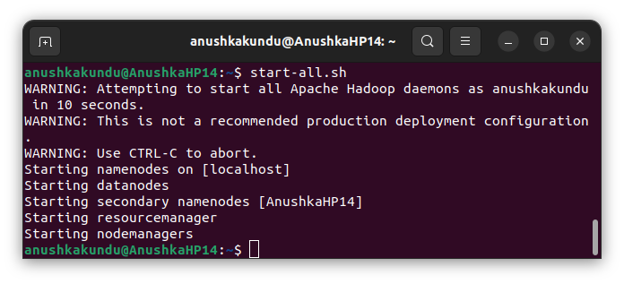
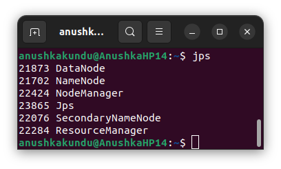
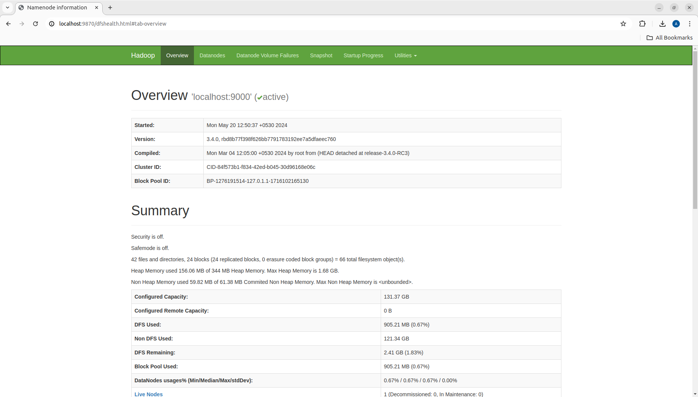
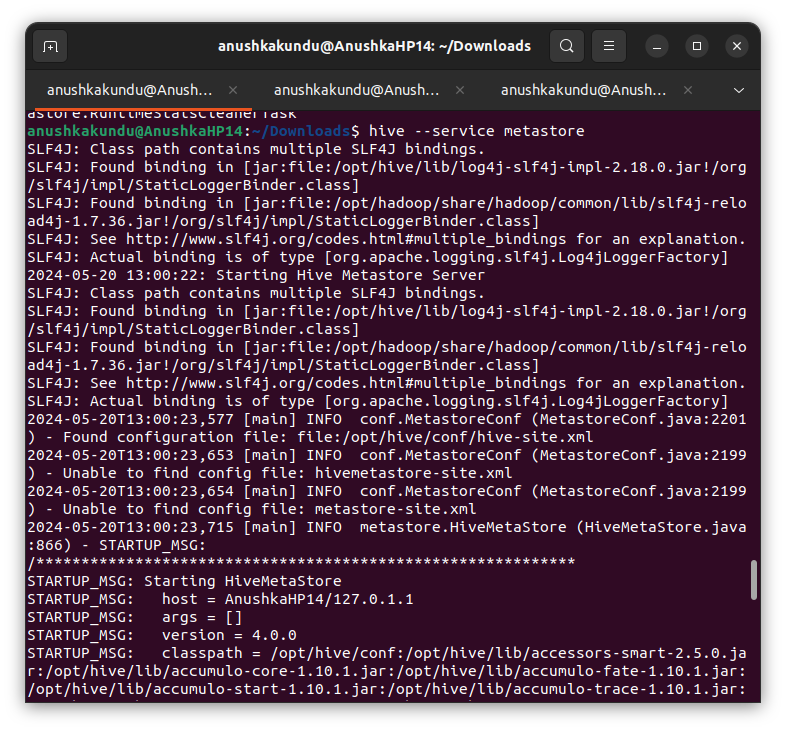
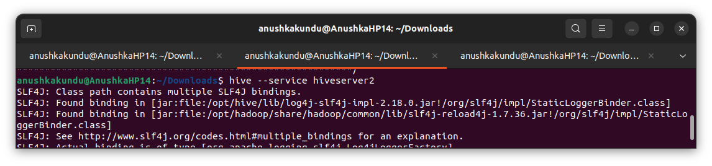
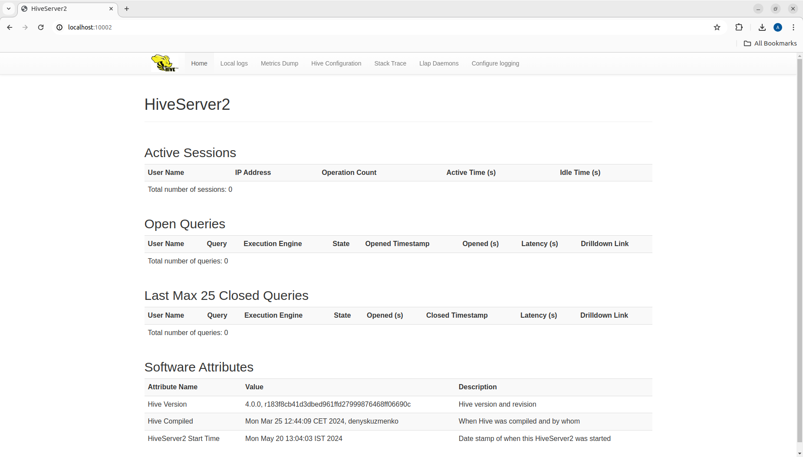
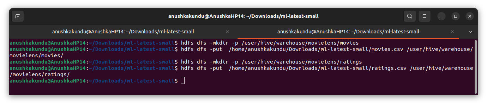
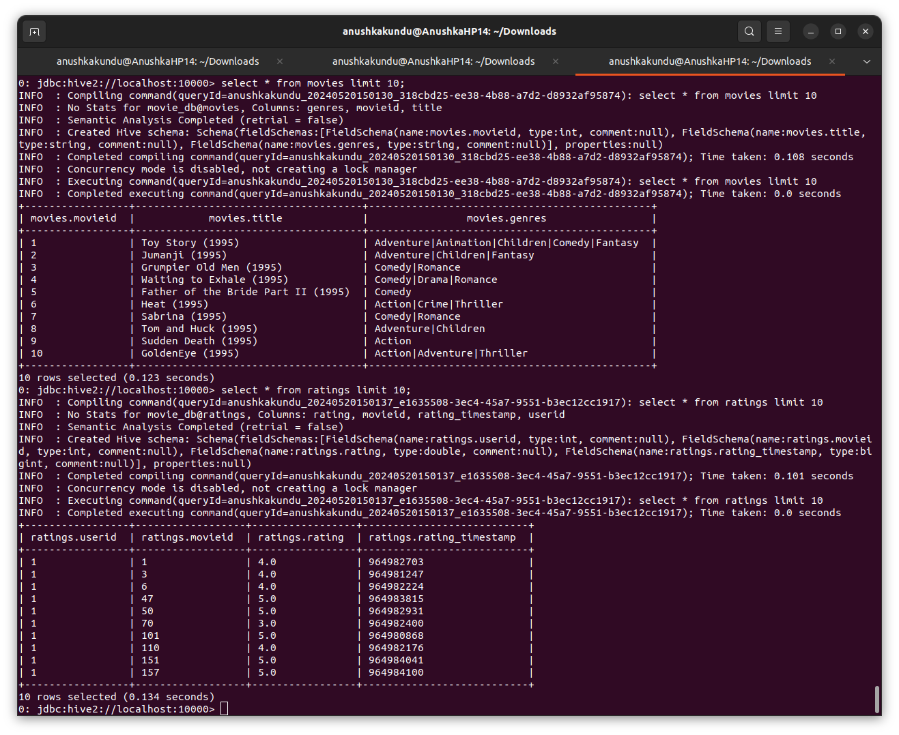

## Start Hadoop
Start Hadoop Cluster
```
start-all.sh

```


Check if Hadoop Cluster is running
```
jps

```


Hadoop is now running



## Start Hive
```
hive --service metastore
```

```
 hive --service hiveserver2
```


Hive is now running at `localhost:10002`: 


## Start Spark


## Create database



Create tables: 
```mysql
# Movies table
CREATE EXTERNAL TABLE movies (
  movieId INT,
  title STRING,
  genres STRING

)
ROW FORMAT SERDE 'org.apache.hadoop.hive.serde2.OpenCSVSerde'
WITH SERDEPROPERTIES (
  "separatorChar" = ",",
  "quoteChar" = "\"",
  "escapeChar" = "\\"
)
STORED AS TEXTFILE
LOCATION '/user/hive/warehouse/movielens/movies'
TBLPROPERTIES ("skip.header.line.count"="1");
```
```mysql
CREATE EXTERNAL TABLE ratings (
  userId INT,
  movieId INT,
  rating DOUBLE,
  rating_timestamp BIGINT
)
ROW FORMAT SERDE 'org.apache.hadoop.hive.serde2.OpenCSVSerde'
WITH SERDEPROPERTIES (
  "separatorChar" = ",",
  "quoteChar" = "\"",
  "escapeChar" = "\\"
)
STORED AS TEXTFILE
LOCATION '/user/hive/warehouse/movielens/ratings'
TBLPROPERTIES ("skip.header.line.count"="1");
```
```mysql
CREATE EXTERNAL TABLE tags (
  userId INT,
  movieId INT,
  tag STRING,
  tag_timestamp BIGINT
)
ROW FORMAT SERDE 'org.apache.hadoop.hive.serde2.OpenCSVSerde'
WITH SERDEPROPERTIES (
  "separatorChar" = ",",
  "quoteChar" = "\"",
  "escapeChar" = "\\"
)
STORED AS TEXTFILE
LOCATION '/user/hive/warehouse/movielens/tags'
TBLPROPERTIES ("skip.header.line.count"="1");
```
```mysql
CREATE EXTERNAL TABLE links (
  movieId INT,
  imdbId INT,
  tmdbId INT
)
ROW FORMAT SERDE 'org.apache.hadoop.hive.serde2.OpenCSVSerde'
WITH SERDEPROPERTIES (
  "separatorChar" = ",",
  "quoteChar" = "\"",
  "escapeChar" = "\\"
)
STORED AS TEXTFILE
LOCATION '/user/hive/warehouse/movielens/links'
TBLPROPERTIES ("skip.header.line.count"="1");
```



## Running MAP-REDUCE queries
<!--
Simple Query example:
```mysql
SELECT movieId, AVG(rating) as avg_rating
FROM ratings
GROUP BY movieId
ORDER BY avg_rating DESC
LIMIT 10;
```


-->
```mysql
CREATE TABLE avg_movie_ratings AS
SELECT movieId, AVG(rating) as avg_rating
FROM ratings
GROUP BY movieId;
```


```mysql
CREATE TABLE top_movies AS
SELECT movieId, avg_rating
FROM avg_movie_ratings
ORDER BY avg_rating DESC;
```


```mysql
CREATE TABLE top_movies_by_genre AS
SELECT g.genre, m.movieId, m.title, AVG(r.rating) AS avg_rating
FROM movies m
JOIN movies_by_genre g ON m.movieId = g.movieId
JOIN ratings r ON m.movieId = r.movieId
GROUP BY g.genre, m.movieId, m.title
ORDER BY g.genre, avg_rating DESC;
```

```mysql
CREATE TABLE movies_by_genre AS
SELECT movieId, genre
FROM movies
LATERAL VIEW explode(split(genres, '[|]')) genreTable AS genre;
```


```mysql
CREATE TABLE user_activity AS
SELECT userId, COUNT(*) as rating_count, AVG(rating) as avg_rating
FROM ratings
GROUP BY userId;
```

```mysql
CREATE TABLE genre_popularity AS
SELECT genre, COUNT(*) as count
FROM movies_by_genre
JOIN ratings ON movies_by_genre.movieId = ratings.movieId
GROUP BY genre;
```


## Movie Recommendation System: Collaborative Filtering
```mysql
CREATE TABLE user_movie_matrix AS
SELECT userId, movieId, rating
FROM ratings;
```

### Movie Similarities (Collaborative Filtering)
```mysql
CREATE TABLE movie_similarities AS
SELECT m1.movieId AS movieId1, m2.movieId AS movieId2, 
       SUM(m1.rating * m2.rating) / (SQRT(SUM(m1.rating * m1.rating)) * SQRT(SUM(m2.rating * m2.rating))) AS similarity
FROM user_movie_matrix m1
JOIN user_movie_matrix m2 ON m1.userId = m2.userId AND m1.movieId != m2.movieId
GROUP BY m1.movieId, m2.movieId;
```


### Genre Similarities (Content-Based Filtering)
```mysql
CREATE TABLE genre_similarities AS
SELECT m1.movieId AS movieId1, m2.movieId AS movieId2, 
       COUNT(*) AS similarity
FROM movies_by_genre m1
JOIN movies_by_genre m2 ON m1.genre = m2.genre AND m1.movieId != m2.movieId
GROUP BY m1.movieId, m2.movieId;
```


### Hybrid Similarities
```mysql
CREATE TABLE hybrid_similarities AS
SELECT c.movieId1, c.movieId2, (c.similarity + g.similarity) / 2 AS hybrid_similarity
FROM movie_similarities c
JOIN genre_similarities g ON c.movieId1 = g.movieId1 AND c.movieId2 = g.movieId2;
```


### Trend Analysis
```mysql
CREATE TABLE movie_trends AS
SELECT YEAR(FROM_UNIXTIME(timestamp)) AS year, genre, COUNT(*) AS count
FROM ratings r
JOIN movies m ON r.movieId = m.movieId
JOIN movies_by_genre g ON m.movieId = g.movieId
GROUP BY year, genre;
```


### Seasonal Effects
```mysql
CREATE TABLE seasonal_effects AS
SELECT MONTH(FROM_UNIXTIME(CAST(rating_timestamp AS BIGINT))) AS month, COUNT(*) AS count
FROM ratings
GROUP BY MONTH(FROM_UNIXTIME(CAST(rating_timestamp AS BIGINT)));
```


###  User Clustering and Profiling
```mysql
CREATE TABLE user_profiles AS
SELECT userId, genre, AVG(rating) AS avg_rating
FROM ratings r
JOIN movies m ON r.movieId = m.movieId
JOIN movies_by_genre g ON m.movieId = g.movieId
GROUP BY userId, genre;
```


### User Engagement
```mysql
CREATE TABLE user_engagement AS
SELECT userId, COUNT(*) AS num_ratings, AVG(rating) AS avg_rating
FROM ratings
GROUP BY userId;
```


### Genre Recommendations
```mysql
CREATE TABLE genre_recommendations AS
SELECT userId, genre, movieId, AVG(rating) AS predicted_rating
FROM user_profiles p
JOIN movies_by_genre g ON p.genre = g.genre
LEFT JOIN ratings r ON g.movieId = r.movieId
GROUP BY userId, genre, movieId
ORDER BY predicted_rating DESC;
```


## Display as a dashboard
```python
import streamlit as st
import pandas as pd
from pyhive import hive
import plotly.express as px

# Function to get data from Hive
@st.cache_data
def get_data(query):
    conn = hive.Connection(host='localhost', port=10000, username='hive')
    cursor = conn.cursor()
    cursor.execute('USE movie_db')  # Set the database
    cursor.execute(query)
    df = pd.DataFrame(cursor.fetchall(), columns=[desc[0] for desc in cursor.description])
    conn.close()
    return df

# Streamlit App
st.title('MovieLens Dashboard')

# Top Movies
st.header('Top Movies')
top_movies_query = "SELECT movieid, title, avg_rating FROM top_movies LIMIT 10"
top_movies_df = get_data(top_movies_query)
st.write(top_movies_df)

# Genre Popularity
st.header('Genre Popularity')
genre_popularity_query = "SELECT genre AS genre, count AS count FROM genre_popularity"
genre_popularity_df = get_data(genre_popularity_query)
fig = px.bar(genre_popularity_df, x='genre', y='count', title='Genre Popularity')
st.plotly_chart(fig)

# Top Movies by Genre
st.header('Top Movies by Genre')
selected_genre = st.selectbox('Select Genre', genre_popularity_df['genre'].unique())
top_movies_by_genre_query = f"""
SELECT movieid, title, avg_rating 
FROM top_movies_by_genre 
WHERE genre = '{selected_genre}'
LIMIT 10
"""
top_movies_by_genre_df = get_data(top_movies_by_genre_query)
st.write(top_movies_by_genre_df)

# User Activity
st.header('User Activity')
user_activity_query = "SELECT userId, rating_count, avg_rating FROM user_activity ORDER BY rating_count DESC LIMIT 10"
user_activity_df = get_data(user_activity_query)
fig = px.bar(user_activity_df, x='userid', y='rating_count', title='Top Active Users')
st.plotly_chart(fig)

# Show top users with number of ratings given
st.header('Top Users by Ratings Given')
top_users_query = "SELECT userid, rating_count FROM user_activity ORDER BY rating_count DESC LIMIT 10"
top_users_df = get_data(top_users_query)
st.write(top_users_df)

# User Profiles
st.header('User Profiles')
user_profiles_query = "SELECT userId, genre, avg_rating FROM user_profiles ORDER BY userId, genre"
user_profiles_df = get_data(user_profiles_query)
st.write(user_profiles_df)

# Movie Trends
st.header('Movie Trends Over Time')
movie_trends_query = "SELECT year, genre, count FROM movie_trends"
movie_trends_df = get_data(movie_trends_query)
fig = px.line(movie_trends_df, x='year', y='count', color='genre', title='Movie Trends Over Time')
st.plotly_chart(fig)

# Seasonal Effects
st.header('Seasonal Effects on Ratings')
seasonal_effects_query = "SELECT month, count FROM seasonal_effects"
seasonal_effects_df = get_data(seasonal_effects_query)
fig = px.bar(seasonal_effects_df, x='month', y='count', title='Seasonal Effects on Ratings')
st.plotly_chart(fig)


# Genre Recommendations
st.header('Genre Recommendations')
user_id = st.number_input('Enter User ID for Recommendations', min_value=1)
if st.button('Get Recommendations'):
    genre_recommendations_query = f"""
    SELECT genre, movieId, predicted_rating 
    FROM genre_recommendations 
    WHERE userId = {user_id}
    ORDER BY predicted_rating DESC
    LIMIT 10
    """
    genre_recommendations_df = get_data(genre_recommendations_query)
    st.write(genre_recommendations_df)

# Start Streamlit app
# if __name__ == '__main__':
#     st.run()
```


